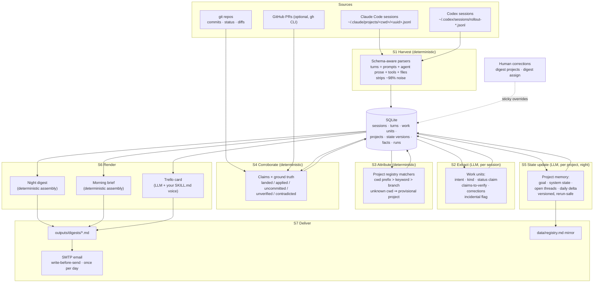

# Daily Work Digest

An agent-native work-memory layer. It reads the raw transcripts of your
coding-agent sessions (Claude Code, Codex), cross-checks what the agents
*claimed* against what git actually shows, and maintains an evolving,
per-project picture of what you are building and why. That picture is
delivered three ways every day, automatically:

- a night **End-of-Day Work Digest** email,
- a morning **Daily Work Brief** email,
- a midday **Trello card** written in your own voice.

I built this because I don't write most of my code by hand anymore; I drive
coding agents. The real record of my work is the prompt/response transcript,
not the diff. Generic summarizers read the diff and tell you *what files
changed*. This reads the conversation and tells you *what you were trying to
do, whether it actually happened, and what is still open*, and it remembers
the answer from day to day.

## What makes it different

**It reads the primary source.** Claude Code and Codex session files are ~98%
tool output and injected context. The harvester parses the transcript schema
properly: your prompts verbatim, the agent's prose, tool calls with failure
tails, files touched, compaction events. The ~1.5% that is signal, and nothing
else, feeds the pipeline.

**Claims are not facts.** An agent saying "done, all tests pass" is a claim.
Every work unit is graded against ground truth by plain set intersection, no
LLM in the loop: files in a commit = *landed*; a Codex harness-applied patch =
*applied*; dirty-tree overlap = *implemented, not committed*; a "done" claim
with no repo evidence = *claimed done, repo disagrees*, in its own section.

**It has memory.** A persistent project registry (SQLite) holds each project's
goal, current state, and open threads with ages. Each night's run merges
today's verified work into that state, so tomorrow's brief starts from an
evolving understanding, not a 48-hour amnesia window. `data/registry.md` is a
human-readable mirror of what the system currently believes.

**Projects stay separate.** Work is attributed to projects by the session's
working directory (deterministic, no guessing). Unknown directories become
*provisional* projects surfaced in the digest for a one-command confirm; a
misattribution is fixed once (`digest assign`) and stays fixed.

**Incidental noise is quarantined.** Fixing a broken venv or a stuck container
is troubleshooting, not project work. Those units are footnoted in the night
digest and never reach project memory or the Trello card.

**The Trello card sounds like you.** The card renderer embeds your actual
Trello-writing skill files (SKILL.md) as its system prompt, hash-logged per
run. If the LLM is unavailable the fallback card is explicitly marked RAW so
an off-voice card never gets pasted by accident.

**Every claim has provenance.** Digest lines cite the exact work unit, which
maps to a session file and turn range on disk. Coverage and run-health lines
are always computed locally, never generated by a model.

## What a night digest looks like

```
## bidgenie-sakesh-fastapi

Goal: Implement and optimize the production system for RFP analysis ...
Today: Today initiated the implementation of production changes for
DeepSeek v3.2, starting with the model-change-validation branch ...

Landed (verified against commits):
- Implement production changes based on the DeepSeek v3.2 diagnostic
  (commit:6856f490ed62, commit:9b8d929fdebc) [claude:9f5d27d1...:2]

Claimed done, repo disagrees:
- Review BeastDB for recent RFP analysis runs ... [claude:57cf59cb...:1]

Course corrections I gave the agent:
- This is only diagnostic and not implementation.

Open threads:
- Agent claimed DeepSeek v3.2 diagnostic report generated; repo shows
  no change. (since 2026-07-13)
```

## Setup

Requires Python 3.12+ on Windows and git. From the project folder:

```powershell
python -m venv .venv
.\.venv\Scripts\python.exe -m pip install -e .
Copy-Item config.example.yaml config.yaml   # set your repos + skill paths
Copy-Item .env.example .env                 # OPENAI_API_KEY (or ANTHROPIC_API_KEY) + SMTP creds
```

Try it:

```powershell
.\.venv\Scripts\python.exe -m digest.cli doctor                       # health check
.\.venv\Scripts\python.exe -m digest.cli pipeline --mode night --print
.\.venv\Scripts\python.exe -m digest.cli send --mode night --dry-run
```

Install the automation (one time):

```powershell
.\scripts\install_windows_task.ps1   # morning 9:00 + logon catch-up, trello 12:45, night 21:30
```

Reports land in `outputs/digests/`, logs in `outputs/logs/`, and
`digest doctor` tells you if anything is off. Without any API key the system
still runs end to end: it produces a deterministic activity report, clearly
labeled, and leaves project memory untouched rather than corrupting it.

## CLI

```text
digest doctor                          health check: config, keys, scheduler, registry
digest pipeline --mode night --print   run the pipeline and print the digest
digest send --mode night --once-per-day    generate + email (scheduler entry point)
digest projects list                   show the registry (goals, status, trello scope)
digest projects confirm <id>           accept a provisionally detected project
digest projects set-goal <id> "..."    correct a project's goal by hand
digest projects rollback <id> <date>   revert project memory to an earlier day
digest assign <unit_key> <project>     reassign a work unit (sticky override)
digest prune --keep-days 90            drop old stored turn text (ids/provenance kept)
```

`digest ingest` / `generate` and the legacy single-call summarizer still exist
behind `pipeline.engine: v1` in config.

## Cost and degradation

A typical day is a handful of `gpt-4o-mini` extraction calls (one per
session), one `gpt-4o` state-update call per active project, and one render
call for the Trello card: roughly $0.05-0.10/day. Each stage fails safe:
extraction failures degrade to activity-only stubs, state-update failures
leave yesterday's memory intact, Trello failures emit a marked-raw card, and
every degradation is printed in the digest's run notes.

## Documentation

- [DESIGN_V2.md](DESIGN_V2.md): the full v2 design, schema findings from real
  session files, data contracts, and rejected alternatives
- [ARCHITECTURE.md](ARCHITECTURE.md): module map (v1 engine internals)
- [CONFIGURATION.md](CONFIGURATION.md): every config key and environment variable
- [OPERATING_MANUAL.md](OPERATING_MANUAL.md): scheduling, manual runs, verifying the next run
- [TROUBLESHOOTING.md](TROUBLESHOOTING.md): common failures and fixes

## Development

```powershell
.\.venv\Scripts\python.exe -m pip install -e .[dev]
.\.venv\Scripts\python.exe -m pytest -q      # fully offline; scripted/fixture LLMs
```

## Architecture



The invariant behind the whole design: **user prompts are the authority on
intent, agent prose is a claim, and only git/harness evidence can promote a
claim to a fact.** Everything else is plumbing to enforce that cheaply.
